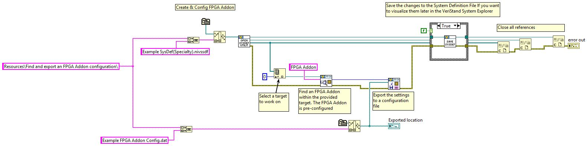

# FPGA Addon Scripting API Examples
The **FPGA Addon Scripting API Examples** project contains VIs that demonstrate the Scripting API.

The project includes:
- Two import scalars examples.
- One import configuration example.
- One export configuration example.

You can run the examples from the LabVIEW project.
1. Open *FPGA Addon Scripting API Examples.lvproj*
1. Open the desired VI.
1. Modify the desired settings.
1. Run the VI.

**Note:** The VI logic is for demonstration purposes only. You should operate any modifications you make. For instance, you may need to change the RIO resource, bitfile address,  etc.

## Example details

### Create and import an FPGA Addon configuration

`Create and import an FPGA Addon configuration.vi` opens an example System Definition and creates an FPGA Addon by importing a configuration.

The VI executes the following steps:
   1. Opens the `Resources\Create and import an FPGA Addon configuration\Example SysDef(Specialty).nivssdf` System Definition.
   1. Selects the first target.
   1. Creates an FPGA Addon under the selected target.
   1. Imports a configuration file.
   1. Gets FPGA Addon information.
   1. If the boolean case selector is true, then the System Definition will be updated with the new settings.

### Create an FPGA Addon and import scalars

`Create an FPGA Addon and import scalars.vi` opens an example System Definition, creates an FPGA Addon and imports all the scalars.

The VI executes the following steps:
   1. Opens the `Resources\Create an FPGA Addon and import scalars\Example SysDef(Specialty).nivssdf` System Definition.
   1. Selects the first target.
   1. Creates an FPGA Addon under the selected target.
   1. Sets a bitfile.
   1. Sets a RIO resource.
   1. Imports all the bitfile scalars.
   1. If the boolean case selector is true, then the System Definition will be updated with the new settings.

### Create an FPGA Addon and selectively import scalars

`Create an FPGA Addon and selectively import scalars.vi` opens an example System Definition, creates an FPGA Addon and imports only specific scalars.

The VI executes the following steps:
   1. Opens the `Resources\Create an FPGA Addon and selectively import scalars\Example SysDef(Specialty).nivssdf` System Definition.
   1. Selects the first target.
   1. Creates an FPGA Addon under the selected target.
   1. Sets a bitfile.
   1. Sets a RIO resource.
   1. Imports specific bitfile scalars by label.
   1. If the boolean case selector is true, then the System Definition will be updated with the new settings.
   
### Find and export an FPGA Addon Configuration

`Find and export an FPGA Addon Configuration.vi` opens an example System Definition, and exports an FPGA Addon configuration.

The VI executes the following steps:
   1. Opens the `Resources\Find and export an FPGA Addon configuration\Example SysDef(Specialty).nivssdf` System Definition.
   1. Selects the first target.
   1. Searches for an FPGA Addon by name.
   1. Exports to a file the configuration of the found FPGA Addon.
   1. If the boolean case selector is true, then the System Definition will be updated with the new settings.