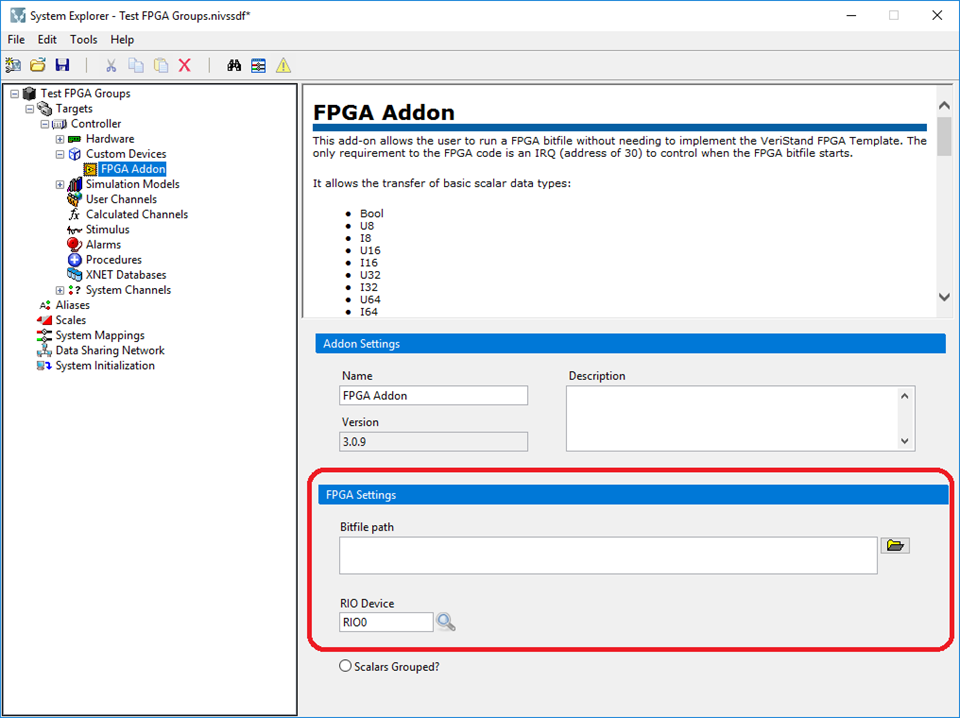

# Overview

This add-on runs a FPGA bitfile without needing to implement the normal VeriStand FPGA template. It allows the transfer of basic scalar data types inline with VeriStand's primary control loop (PCL). It also adds support for reading/writing waveforms with FPGA DMA channels.​

 
 

# Repo location

[Github](https://github.com/ni/niveristand-fpga-addon-custom-device)

---
 

# Requirements

These drivers must be installed on the deployment computer/target to function:

- NI VeriStand 2018 or later
- NI RIO 18.0 or later
---
 

# FPGA Specifics

To use the addon, first create an FPGA VI. Use the provided FPGA IP (discussed below) or custom logic. Put items of interest to front panel controls and indicators. Put waveforms of interest to DMA channels. __It is a requirement to the FPGA code to have an IRQ (address of 30) to control when the FPGA bitfile starts.__ This IRQ only needs to control when DMA read/write operations start. Any other code can start whenever it makes sense. Below is an example showing DMA, controls, and indicators.

---

# Supported Datatypes

## Scalar Datatypes (Controls and indicators)

- Bool
- U8
- U16
- U32
- U64
- I8
- I16
- I32
- I64
- SGL
- FXP +16.3
- FXP +/-16.5
- FXP +/-16.7
- FXP +18.3
- FXP +/-20.5
- FXP +/-24.5
- FXP +/-27.5
- FXP +/-32.8
- FXP +/-32.16
- FXP +/-64.32

**Note**: Enum​s are not supported. Conve​rt them to a U8, U16, or U32 control or indicator. **Clusters are not supported.** Even if the clusters are made up of supported types. Items can be grouped by naming them on the FPGA with a **_GroupName.SignalName_** format. Support for grouping can only be set on the initialization screen.

---
 

## DMA Datatypes

- U8
- I8
- U16
- I16
- U32
- I32
- U64
- I64
- SGL
- FXP +/-32.8
- FXP +/-32.16
- FXP +/-64.32

---
**Note** The unsigned integer data types can be converted into a bitpacked Boolean array. This is discussed in detail below.

 

## Specialty IO

The addon comes with special IP for doing the following:

- PWM Generation - **PWM.Generate.Digital(.vi)**
- Sinewave Generation - **Sine.Generate(.vi)**
- Digital Static Generation  - **Static.Generate.Digital(.vi)**
- Analog PWM Measurement - **PWM.Measure.Analog(.vi)**
- Digital PWM Measurement - **PWM.Measure.Digital(.vi)**
- Digital Static Measurement - **Static.Measure.Digital(.vi)**
- Digital Wheel Speed Sensor Simulation - **WSS.Generate.Digital(.vi)**
- Quadrature Encoder Measurement - **QuadratureEncoder.Measure.Digital(.vi)**

This IP is located at:

_C:\Users\Public\Documents\National Instruments\NI VeriStand **_Year_**\Custom Devices\FPGA Addon\FPGA IP​_ -> Location is to still be discussed. 

---

**Note**: **The FPGA Addon supports up to a total of 128 channels for controls, indicators and DMAs for a given FPGA bitfile.**

---
 

## Example Programs

Examples of how to use the speciality IO, controls/indicators, and DMA are included in the source code in the _Testing Folder_. Here is an example of the speciality IO: -> Location of these examples still to be discussed

---
 
 

# Addon Specifics

Uppon adding and FPGA Addon CD within the System Definition, a configuration GUI will open:

Notice the option to group scalars. This will combine FPGA controls or indicators named with the **_GroupName.SignalName_** format into a group of channels. This is an option that is set upon initialization and cannot be changed after.

---

A previously exported addon configuration can be imported.

---

Once the FPGA Addon Custom Device has been added, on the main page, set the path to ​​​the desired bitfile.​​ Select the RIO device. The search button (magnifier glass icon) will detect the available FPGAs on the currently specified Target/Controller.

---

**Note:** Notice the built in help. This help provides the details needed to use each section.​

---
 

When the bitfile is selected, the available DMA and scalar registers are discovered. To add these scalars and DMA to the configuration, go to the **Scalars** and **Waveforms** sections respectively.

Select the items and hit Add Selected. If an item doesn't show up, it is likely not a supported data type or the bitfile has not been re-compiled after changes

---

Any scalar integer values can be converted to support Boolean bitpacking. However, this is something that must be first programmed in the FPGA. It is also something that is not "discoverable" by the addon. Therefore the user must configure the addon manually to match what is programmed in the FPGA.

As an example, the FPGA program could take 8 Boolean lines, build an array, and convert it to a number as follows.

This significantly improves performance. If this is implemented in the FPGA, manually find the related indicator in the VeriStand configuration and select to enable bitpacking.

Once the channel is converted to a bitpacking section, enter in the number of channels being bitpacked. Then hit apply.

This will add 8 Boolean channels to the configuration. The user can then name the channels anything. Array index order will be maintained regardless of naming. The top most channel is always index 0 while the bottom most channel is always the last index (7 in this case).

When Speciality IO is added, channels will be grouped together. Here is an example of an analog PWM IO core.

---

Adding DMA and waveforms works in a very similar way. Go to the Waveform Inputs or Waveform Outputs section and add any desired DMA.

---

The DMA is automatically "discoverable"' but the FPGA programming leading up to the DMA is not. Therefore, the user must manually tell the addon how the DMA is being used in the F​PGA program. Take this FPGA loop as an example:

The DMA "Medium" has 16 channels written per loop iteration. Each loop iteration takes 10 microseconds. The writing is continuous. This data is interleaved. So, in the addon DMA configuration section, define the number of channels, mode, scheme, and expected sample period (acquisition rate). Hit apply.

---
 

​For a DMA channel, continuous or finite acquisitions are supported.

Again, this setting should match what was programmed on the FPGA. If the FPGA was programmed as a continuous generation (FPGA to Host), setting a Triggered Finite mode would cause overflows.

---
 

As with scalars, certain data types support bitpacking. With interleaved data, multiple channels are sampled at the same time (see "Medium" DMA example above) and transfered one right after another within a single loop iteration. Each channel is a data packet in the DMA. If there are 8 channels, a single acquisition/loop iteration would have 8 data packets. In the case of bitpacked​, each data packet is a complete acquisition for a group of Boolean channels. The maximum number of channels is set by the data type. Below is an example of an FPGA program bitpacketing a DMA.

​Notice how there is no For Loop per single loop iteration. Notice how a single packet represents multiple channels. ​In this case, select Bitpacked from the Delacing Scheme.

---
 
 

# Addon Execution

Deploy the system definition. From within the user interface, drag and drop channels or groups of channels.

 

Change required channels to controls, such as Trigger and anything in Settings.

---
 

Certain channels can be added as Rings to show text. The Error Code channel supports this.​

---
 

​To view waveforms, open the Workspace.

Add a waveform plot and configure.
 

---
 

# System Definition API

There is also a system definition API that allows the user to programatically create an instance of the addon from a previously exported configuration. This is installed at:

C:\Users\Public\Documents\National Instruments\NI VeriStand __**Year**__\Custom Devices\FPGA Addon\Windows\System Definition API

An example of using this API is as follows:​​

---
 

**Note:** The embedded UI on Linux targets must be disabled or error -307556 will be returned.​
 

